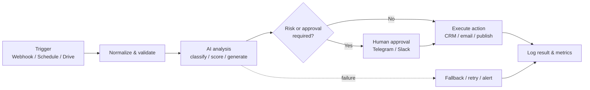

<div align="center">

# ⚡ AI Automation Portfolio

### Practical AI workflows that turn repetitive operations into reliable systems

<p>
  <a href="https://github.com/RimmaMaevaL/portfolio/tree/main/projects"><strong>Explore projects</strong></a>
  ·
  <a href="https://github.com/RimmaMaevaL/portfolio/blob/main/docs/WORKFLOW_MAP.md"><strong>View workflow map</strong></a>
  ·
  <a href="https://www.linkedin.com/in/lialko-maria-b46b22427"><strong>Connect on LinkedIn</strong></a>
</p>


</div>

---

## 👋 About

I’m **Maria Lialko**, a Junior AI Automation Engineer focused on designing n8n workflows that connect AI models, CRMs, communication tools, and business data.

This portfolio demonstrates how I approach automation: start with a real operational bottleneck, design a clear workflow, add guardrails and observability, then make the result easy for a human team to use.

> **Portfolio note** — These are educational and portfolio projects. Replace credentials, personal data, connection details, and test endpoints before deploying any workflow in production.

## ✨ What you’ll find here

| Area | Examples |
|---|---|
| **Sales automation** | Lead qualification, CRM enrichment, deal-health scoring, objection handling |
| **Customer support** | Ticket triage, sentiment analysis, SLA monitoring, escalation |
| **Quality assurance** | Call transcription, structured scoring, manager review, feedback loops |
| **Content operations** | AI generation, approval gates, publishing, decision logging |
| **Reliable integrations** | Webhooks, REST APIs, Google Workspace, Telegram, Slack, Zoho CRM, Qdrant |

## 🚀 Featured projects

| Project | The workflow | Stack |
|---|---|---|
| [**AI Call QA & Escalation**](projects/ai-call-qa-escalation) | Transcribes support calls, scores eight QA criteria, escalates weak results, and sends customer communication only after approval. | `n8n` `Groq/Llama` `Whisper` `Sheets` `Telegram` `Gmail` |
| [**AI Ticket Routing & SLA**](projects/ai-ticket-routing-sla) | Classifies incoming tickets, calculates deadlines, tracks SLA risk, and routes escalations. | `n8n` `Groq/Llama` `Sheets` `Slack` |
| [**AI Sales Intelligence**](projects/ai-sales-intelligence) | Analyzes CRM activity, scores deal health, and delivers actionable sales reports. | `n8n` `Zoho CRM` `Claude` `Telegram` |
| [**AI Sales Assistant**](projects/ai-sales-assistant) | Uses retrieval-augmented context to support objection handling and generate call scripts. | `n8n` `Qdrant` `Gemini` `Claude` `Telegram` |
| [**AI Lead & Marketing Automation**](projects/ai-lead-marketing-automation) | Captures website leads, syncs CRM records, segments contacts, and triggers marketing actions. | `n8n` `Wix` `Zoho CRM` `Klaviyo` |
| [**Website Inquiry Automation**](projects/website-inquiry-automation) | Deduplicates inquiries, flags priority, sends confirmations, and starts follow-up sequences. | `n8n` `Webhooks` `Sheets` `Gmail` |
| [**AI Self-Care Bot**](projects/ai-self-care-bot) | Turns daily check-ins into context-aware tasks and personal tracking. | `n8n` `LLM` `Telegram` `Sheets` |
| [**AI Image Approval Pipeline**](projects/ai-image-approval-publishing) | Generates visual content, sends a preview for review, and publishes only after explicit approval. | `n8n` `Image APIs` `Telegram` |

## 🧠 My automation principles

- **Human-in-the-loop by default** — sensitive or customer-facing actions require an explicit approval step.
- **Structured AI outputs** — predictable JSON and validation instead of fragile free-form text.
- **Idempotent workflows** — deduplication and status checks prevent duplicate actions.
- **Observable execution** — clear logs, decision records, fallback paths, and useful notifications.
- **Useful before flashy** — automation should remove operational friction and make the next action obvious.

## 🧩 Typical architecture



## 🛠️ Tech stack

**Automation**  `n8n` · Webhooks · REST APIs · JavaScript expressions  
**AI**  `OpenAI` · `Anthropic Claude` · `Groq / Llama` · `OpenRouter` · `Google Gemini`  
**Data & CRM**  `Zoho CRM` · `PostgreSQL` · `Qdrant` · `Google Sheets`  
**Communication**  `Telegram` · `Slack` · `Gmail`  
**Marketing**  `Wix` · `Klaviyo`

## 🗂️ Repository map

```text
portfolio/
├── README.md                         ← you are here
├── docs/
│   └── WORKFLOW_MAP.md               ← cross-project architecture map
└── projects/
    ├── ai-call-qa-escalation/
    ├── ai-ticket-routing-sla/
    ├── ai-sales-intelligence/
    ├── ai-sales-assistant/
    ├── ai-lead-marketing-automation/
    ├── website-inquiry-automation/
    ├── ai-self-care-bot/
    └── ai-image-approval-publishing/
```

Every project includes a focused case study with the business problem, workflow logic, integrations, expected outcome, and available n8n modules.

## 📬 Let’s connect

Open to junior opportunities in **AI automation, CRM integrations, customer-support systems, and workflow design**.

- **LinkedIn:** [lialko-maria-b46b22427](https://www.linkedin.com/in/lialko-maria-b46b22427)
- **GitHub:** [mariiarimmal-design](https://github.com/mariiarimmal-design)

<div align="center">

**Build less manual work. Keep humans in control.**

</div>
