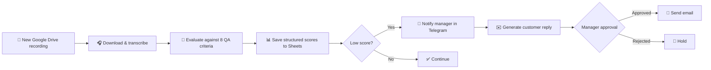

# 🧾 AI Call QA & Escalation System

### AI-powered quality assurance for support calls, without drowning managers in manual review

  <a href="../../">← Back to portfolio</a>
  ·
  <a href="https://github.com/RimmaMaevaL/portfolio/tree/main/projects/ai-call-qa-escalation">Browse project files</a>

---

## ✨ What this project does

This workflow reviews customer-support calls with AI, scores them against critical QA criteria, and escalates weak results before issues become bigger operational problems.

The goal is simple: reduce review time, keep quality consistent, and make only the truly risky calls require human intervention.

## 🎯 The business challenge

Manual call reviews consumed hours every week, while serious service issues could be discovered too late. Managers needed a faster, structured way to detect weak conversations and respond early.

## 🔄 Workflow at a glance

## 🧠 QA dimensions evaluated

The AI scores the transcript across:

- greetings
- active listening
- needs discovery
- empathy
- expertise
- solution clarity
- next steps
- closing quality

This makes the signal measurable and easier to act on compared with a vague “good / bad” verdict.

## 🛠️ Technology stack

| Component | Role |
|---|---|
| **n8n** | Workflow orchestration and automation |
| **Groq / Llama 3.3 70B** | call evaluation and reasoning |
| **Whisper-compatible transcription** | transcript generation |
| **Google Drive** | source audio files |
| **Google Sheets** | structured QA logs |
| **Telegram** | manager escalation |
| **Gmail** | customer follow-up |

## 📦 Included workflow modules

| File | Purpose |
|---|---|
| [`main-call-qa-workflow.json`](main-call-qa-workflow.json) | main QA evaluation workflow |
| [`notify-manager-on-bad-ticket.json`](notify-manager-on-bad-ticket.json) | escalation logic for weak calls |
| [`get-client-email-by-recording-url.json`](get-client-email-by-recording-url.json) | fetch customer contact details |
| [`manager-decision-send-email.json`](manager-decision-send-email.json) | human-approved response path |

## ✅ Outcome

The case targets a 90% reduction in QA review time, saving roughly 8–12 hours per week. In production, this kind of workflow is strongest when paired with real review baselines and manager feedback loops.

---

**Faster review. Better quality control. More time for real customer recovery.**

