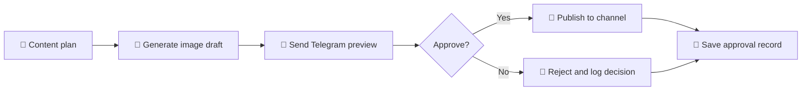

# 🖼️ AI Image Generation & Approval-Gated Publishing

### AI creates the first draft, humans keep the final call

  <a href="../../">← Back to portfolio</a>
  ·
  <a href="https://github.com/RimmaMaevaL/portfolio/tree/main/projects/ai-image-approval-publishing">Browse project files</a>

---

## ✨ What this project does

This pipeline turns a content plan into an image draft, sends the draft for approval, and publishes only after an explicit human decision.

It is designed for teams that want the speed of AI generation without losing editorial control.

## 🎯 The business challenge

Content teams often face a trade-off: generate faster, or keep quality under human oversight. This workflow tries to solve both. It gives the team a quick visual draft while ensuring that nothing goes live without approval.

## 🔄 Workflow at a glance

## 🧠 Why this pattern works

- **Speed:** creates content quickly
- **Control:** adds human review before publishing
- **Traceability:** records who approved or rejected the asset
- **Editorial safety:** reduces accidental public publishing

## 🛠️ Technology stack

| Component | Role |
|---|---|
| **n8n** | orchestration, routing, approval flow |
| **Gemini / DALL·E / Leonardo** | image generation |
| **Telegram Bot API** | preview and decision workflow |

## 📦 Included workflow modules

| File | Status |
|---|---|
| [`ai-image-approval-publishing.json`](ai-image-approval-publishing.json) | JSON export pending or to be added |

> The current upload does not include the workflow export, but the logic and approval pattern are clearly structured for future implementation.

## ✅ Outcome

A human approval gate preserves editorial quality while keeping content generation fast enough for iterative publishing workflows.

---

**AI drafts fast. Humans decide what goes live.**

