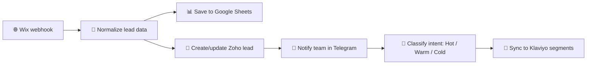

# 💼 AI Lead Qualification & Marketing Automation

### From website form to CRM, segmentation, and action — without manual lead handling

  <a href="../../">← Back to portfolio</a>
  ·
  <a href="https://github.com/RimmaMaevaL/portfolio/tree/main/projects/ai-lead-marketing-automation">Browse project files</a>

---

## ✨ What this project does

This workflow receives submissions from a Wix website, normalizes the incoming lead data, creates or enriches a CRM record, and segments the audience for future marketing actions.

It combines lead capture, intent classification, and campaign routing into a single system.

## 🎯 The business challenge

A beauty-salon team needed a faster way to process inquiries without losing data quality or delaying follow-up. Manual handling often created slow response times and inconsistent lead classification.

## 🔄 Workflow at a glance

## 🧠 What the automation handles

- captures the lead from the website
- standardizes inbound data
- creates a CRM record
- flags urgency or intent
- informs the team right away
- pushes the right audience into marketing automation

## 🛠️ Technology stack

| Component | Role |
|---|---|
| **n8n** | orchestration and lead processing |
| **Wix** | lead capture source |
| **Zoho CRM** | customer record management |
| **Klaviyo API** | list segmentation and marketing sync |
| **Google Sheets** | temporary storage and operational visibility |
| **Telegram** | team notifications |
| **OpenRouter** | AI classification layer |

## 📦 Included workflow modules

| File | Purpose |
|---|---|
| [`wix-lead-marketing-automation.json`](wix-lead-marketing-automation.json) | main lead pipeline |

## ✅ Outcome

The workflow is designed to reduce manual handling significantly, cutting response time from minutes to seconds and making lead classification more consistent.

---

**Captures better leads. Routes them faster. Activates the right marketing response.**

