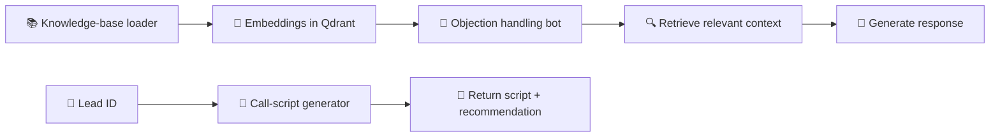

# 🤖 AI Sales Assistant

### A smart sales copilot for objection handling and call-script generation

  <a href="../../">← Back to portfolio</a>
  ·
  <a href="https://github.com/RimmaMaevaL/portfolio/tree/main/projects/ai-sales-assistant">Browse project files</a>

---

## ✨ What this project does

This system combines a Qdrant knowledge base with Telegram-based sales tooling. It helps sales teams handle objections and generate lead-specific call scripts based on context.

It is a practical example of retrieval-augmented generation applied to real sales operations.

## 🎯 The business challenge

Sales teams often lose time searching for the right response to objections or preparing a consistent script for each lead. Without a reusable knowledge layer, the quality of outbound communication varies a lot.

## 🔄 Workflow at a glance

## 🧠 Included capabilities

- Knowledge-base loader for objection and case records
- Telegram objection-handling bot
- Call-script generator for a specific lead
- Response logic combining retrieved context with AI reasoning

## 🛠️ Technology stack

| Component | Role |
|---|---|
| **n8n** | automation orchestration |
| **Qdrant** | vector search and memory store |
| **Google Gemini embeddings** | semantic embeddings |
| **Anthropic Claude** | response generation and reasoning |
| **Zoho CRM** | lead context source |
| **Telegram** | interface for sales teams |

## 📦 Included workflow modules

| File | Purpose |
|---|---|
| [`qdrant-knowledge-base-loader.json`](qdrant-knowledge-base-loader.json) | prepares and stores knowledge base |
| [`telegram-objection-handling-bot.json`](telegram-objection-handling-bot.json) | objection support bot |
| [`lead-call-script-generator.json`](lead-call-script-generator.json) | lead-specific call script generation |

## ✅ Outcome

A call script can be returned in Telegram in under 10 seconds after a valid lead ID is submitted. The project also captures a good technical lesson: complex automation logic must be designed with concurrency and dependency handling in mind.

---

**Better answers. Better scripts. Better sales conversations.**

