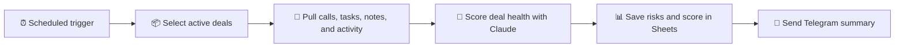

# 📈 AI Sales Intelligence

### Deal health, risk signals, and reporting — all without the manual CRM review loop

  <a href="../../">← Back to portfolio</a>
  ·
  <a href="https://github.com/RimmaMaevaL/portfolio/tree/main/projects/ai-sales-intelligence">Browse project files</a>

---

## ✨ What this project does

This workflow retrieves deal activity from Zoho CRM, scores each deal’s health using AI, identifies risk indicators, and sends a readable report to Telegram.

Instead of manually opening each deal, managers receive a structured summary backed by actual CRM evidence.

## 🎯 The business challenge

Management lacked a consistent view of deal status without manually inspecting CRM records, activities, dates, and notes. Risk signals were scattered and difficult to compare across numerous deals.

## 🔄 Workflow at a glance

## 🧠 What gets evaluated

- deal health score (1–10)
- risk drivers and evidence
- account activity recency
- operational concerns from notes and record activity
- next best action signals for the sales team

## 🛠️ Technology stack

| Component | Role |
|---|---|
| **n8n** | orchestration and execution |
| **Zoho CRM** | source of deal, activity, and note data |
| **Claude Opus / Sonnet** | health scoring and risk reasoning |
| **Google Sheets** | result storage and operational visibility |
| **Telegram** | delivery of reports |

## 📦 Included workflow modules

| File | Purpose |
|---|---|
| [`deal-health-alerts.json`](deal-health-alerts.json) | main deal health workflow |
| [`get-zoho-lead-activities.json`](get-zoho-lead-activities.json) | fetch CRM activity and context |
| [`ai-sales-reporting.json`](ai-sales-reporting.json) | produce summary reports |

## ✅ Outcome

Regular deal-health reporting runs without a manual CRM review step, making pipeline monitoring more proactive and significantly easier to scale.

---

**Clearer pipeline health. Faster managerial decisions. Less CRM drift.**

