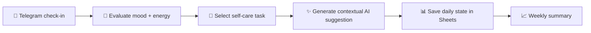

# 🧘 AI Self-Care Bot

### A personal wellness assistant that turns daily check-ins into structured actions

  <a href="../../">← Back to portfolio</a>
  ·
  <a href="https://github.com/RimmaMaevaL/portfolio/tree/main/projects/ai-self-care-bot">Browse project files</a>

---

## ✨ What this project does

This personal Telegram bot checks mood and energy, chooses suitable self-care tasks, generates contextual AI suggestions, logs daily state, accepts notes, and provides weekly statistics.

It is a lightweight example of how AI can support daily wellbeing in a structured and consistent way.

## 🎯 The business challenge

People often know they need a reset, but they do not have a simple system for turning vague feelings into concrete, repeatable actions. This bot helps by turning a daily mood check into a guided, practical routine.

## 🔄 Workflow at a glance

## 🧠 Honest technical reflection

The workflow demonstrates context-aware suggestions rather than generic advice. It is a solid MVP, and the next logical improvement is adding a true history-based recommendation layer instead of relying only on a demo weekly dataset.

## 🛠️ Technology stack

| Component | Role |
|---|---|
| **n8n** | workflow orchestration |
| **Groq / LLM API** | contextual suggestions and reasoning |
| **Telegram** | user interaction layer |
| **Google Sheets** | daily state and statistics log |

## 📦 Included workflow modules

| File | Purpose |
|---|---|
| [`ai-self-care-bot.json`](ai-self-care-bot.json) | main self-care workflow |

## ✅ Outcome

The bot helps turn a vague feeling into a concrete, repeatable wellness action. It is a useful example of AI applied to personal routines, habit loops, and self-awareness.

---

**Healthy routines start with simple, consistent check-ins.**

