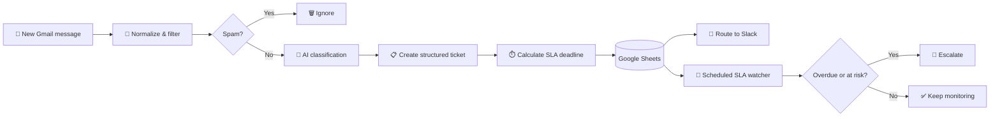

# 🎫 AI Ticket Routing & SLA Control Tower

### Turn incoming support emails into prioritized, measurable, and actionable work

  <a href="../../">← Back to portfolio</a>
  ·
  <a href="https://github.com/RimmaMaevaL/portfolio/tree/main/projects/ai-ticket-routing-sla">Browse project files</a>

---

## ✨ What this project does

An AI-powered support-operations system for an online confectionery. It transforms unstructured Gmail messages into structured ticket records, routes them to the right team, and continuously watches for SLA risks before they become customer escalations.

> **The result:** support teams get a clear next action, a visible deadline, and an escalation path — without manually triaging every message.

## 🎯 The business challenge

Support requests were triaged manually, which made it easy to miss urgent issues and discover SLA breaches only after a customer followed up.

This workflow addresses the gap with three layers:

| Layer | What it solves |
|---|---|
| **AI triage** | Understands the message and extracts category, priority, sentiment, owner, and reasoning |
| **Operational memory** | Stores every non-spam ticket in a searchable Google Sheets register |
| **SLA control** | Checks overdue tickets on a schedule and alerts the right people in Slack |

## 🔄 Workflow at a glance

## 🧠 What the AI extracts

Each incoming ticket is converted into a structured operational record containing:

- **Category** — the type of customer request
- **Priority** — how urgently the issue should be handled
- **Owner** — the responsible team or person
- **SLA target** — the response deadline based on priority
- **Sentiment** — an early signal of customer frustration or risk
- **Reasoning** — an explainable summary of the classification
- **Routing data** — the Slack destination and escalation path

Structured output makes the automation easier to validate, audit, and connect to downstream systems than free-form AI responses.

## 📊 Demonstrated outcome

| ⚡ First classification | 🔔 SLA visibility | 🧩 Configuration |
|:---:|:---:|:---:|
| **Under 1 minute** | Scheduled monitoring | Thresholds & recipients configurable |

The setup is designed as a practical demonstration. Production performance should be validated with execution history, ticket volume, response-time baselines, and false-positive rates.

## 🛠️ Technology stack

| Component | Role |
|---|---|
| **n8n** | Workflow orchestration, branching, scheduling, and integrations |
| **Groq / Llama 3.3 70B** | Ticket classification, sentiment analysis, and reasoning |
| **Gmail** | Incoming support-message trigger |
| **Google Sheets API** | Ticket register, SLA fields, and analysis source |
| **Slack API** | Routing, notifications, and escalation alerts |

## 📦 Included workflow modules

| File | Purpose |
|---|---|
| [`ai-ticket-routing-sla-escalation.json`](ai-ticket-routing-sla-escalation.json) | Main intake, AI triage, SLA calculation, logging, and routing workflow |
| [`sla-escalation-watcher.json`](sla-escalation-watcher.json) | Scheduled scan for overdue tickets and escalation notifications |
| [`quantitative-ticket-analysis.json`](quantitative-ticket-analysis.json) | Quantitative analysis of ticket volume and operational patterns |
| [`qualitative-ticket-analysis.json`](qualitative-ticket-analysis.json) | Qualitative analysis of topics, sentiment, and recurring issues |

## ✅ Automation principles demonstrated

- **Explainable AI** — classification includes reasoning instead of an opaque label.
- **Operational visibility** — tickets, deadlines, and statuses are stored in one register.
- **Proactive escalation** — the system watches for SLA risk instead of waiting for complaints.
- **Configurable rules** — SLA thresholds and notification recipients can be adapted to the team.
- **Human-friendly routing** — AI prepares the decision; Slack makes the next action visible.

## 🚀 Possible production extensions

- Add a human review branch for low-confidence classifications.
- Replace Google Sheets with a ticketing system or relational database at higher volume.
- Track resolution time and SLA compliance dashboards over time.
- Add deduplication for repeated customer messages and thread-level context.
- Introduce retries, dead-letter handling, and alerting for failed integrations.

---

**Less manual triage. Earlier escalation. Better support operations.**

