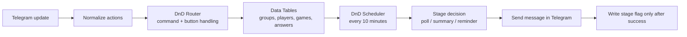

# D&D Session Organizer Bot

A Telegram bot that automates session polling, GM summaries, and player reminders for tabletop RPG parties.

## Business problem

A game master running 2 to 4 parties of 4 to 5 players spent 30 to 45 minutes every week manually asking who was attending each session, chasing silent players, and renegotiating when attendance collapsed.

## Workflow

The bot runs two main workflows:

**DnD Router** (19 nodes) receives every Telegram update and turns it into a list of actions with an operation field. A Switch node routes those actions to executor nodes that match command patterns.

**DnD Scheduler** (13 nodes) runs every 10 minutes, creates the next session from the schedule, and sends what is due at each stage:

1. Poll with Yes and No buttons at T-48h.
2. GM summary with three decision buttons about 12h after the poll.
3. Reminder for players who said yes and re-tag of silent players at T-24h.
4. Re-tag of silent players only at T-4h.
5. Final reminder at T-2h or a joke if the session was cancelled.

Quiet hours from 00:00 to 07:00 allow only the T-2h reminder. State lives in four n8n Data Tables: `dnd_groups`, `dnd_players`, `dnd_games`, and `dnd_answers`.

## Stack

`n8n` · `Telegram Bot API` · `n8n Data Tables` · `JavaScript` · `Luxon` · `PikaPods`

## Outcome

The bot removes the manual coordination work from the GM and reduces silent-player churn before each session. It handles polling, reminders, and summary decisions in one place, while keeping per-party permissions and stage logic deterministic.

## Privacy note

Screenshots come from a test chat. No player names, Telegram IDs, or personal data are published.

## Modules

- `dnd-router.json`
- `dnd-scheduler.json`
