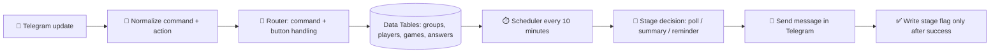

# 🎲 D&D Session Organizer Bot

### A Telegram bot that keeps group sessions organized without the manual chaos

  <a href="../../">← Back to portfolio</a>
  ·
  <a href="https://github.com/RimmaMaevaL/portfolio/tree/main/projects/dnd-session-organizer-bot">Browse project files</a>

---

## ✨ What this project does

This Telegram bot automates session polling, GM summaries, and player reminders for tabletop RPG parties.

It keeps the game master from manually chasing attendance and reduces “silent-player” churn before each session.

## 🎯 The business challenge

A game master running multiple groups spent significant time each week asking who was attending, reminding players, and managing session decisions. That manual overhead created friction before the game even started.

## 🔄 Workflow at a glance

## 🧠 How it works

The bot runs two main workflows:

- **DnD Router** handles Telegram updates and routes actions by command or button
- **DnD Scheduler** manages timed reminders and session stages

It supports a lifecycle of:

1. poll at T-48h
2. GM summary at T-12h
3. reminder for confirmed players at T-24h
4. re-tagging of silent players at T-4h
5. final reminder at T-2h or cancellation message

## 🛠️ Technology stack

| Component | Role |
|---|---|
| **n8n** | orchestration and stateful automation |
| **Telegram Bot API** | interaction layer |
| **n8n Data Tables** | persistent party and session state |
| **JavaScript** | process logic and stage handling |
| **Luxon** | time scheduling and deadlines |
| **PikaPods** | environment hosting |

## 📦 Included workflow modules

| File | Purpose |
|---|---|
| [`dnd-router.json`](dnd-router.json) | Telegram command and button router |
| [`dnd-scheduler.json`](dnd-scheduler.json) | periodic reminder and stage dispatch |

## ✅ Outcome

The bot removes the repeated coordination work from the game master and keeps each session more predictable and easier to run.

---

**Fewer manual reminders. More time for play.**

