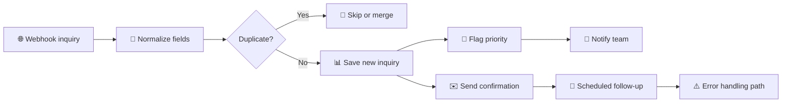

# 🌐 Website Inquiry Automation

### A reliable inquiry pipeline that prevents duplicate or missed follow-ups

  <a href="../../">← Back to portfolio</a>
  ·
  <a href="https://github.com/RimmaMaevaL/portfolio/tree/main/projects/website-inquiry-automation">Browse project files</a>

---

## ✨ What this project does

This workflow receives website inquiries, normalizes the data, checks for duplicates, flags priority, and sends confirmations or follow-ups automatically.

It is designed to reduce missed leads and avoid the common operational issue of sending duplicate reminders.

## 🎯 The business challenge

A form submission system without proper deduplication and state tracking can create duplicate records, forgotten leads, or spammy follow-up loops. This workflow solves that by making the lifecycle visible and repeat-safe.

## 🔄 Workflow at a glance

## 🧠 What makes this workflow robust

- deduplicates by email or phone
- stores status and processing history
- prevents repeated reminder loops
- creates actionable visibility for the team
- includes clear error handling

## 🛠️ Technology stack

| Component | Role |
|---|---|
| **n8n** | orchestration and state management |
| **Webhooks** | lead capture |
| **Google Sheets** | inquiry records and tracking |
| **Gmail** | confirmation and follow-up emails |
| **Telegram** | internal notifications |

## 📦 Included workflow modules

| File | Purpose |
|---|---|
| [`website-inquiry-main.json`](website-inquiry-main.json) | main inquiry pipeline |
| [`website-inquiry-follow-up.json`](website-inquiry-follow-up.json) | reminder and re-engagement flow |
| [`website-inquiry-error-handler.json`](website-inquiry-error-handler.json) | error handling and alerts |

## ✅ Outcome

The system is designed so an inquiry is not silently lost or processed twice. Status updates prevent repeated reminder messages and keep the lead lifecycle under control.

---

**No silent leads. No duplicate follow-ups. More reliable conversions.**

