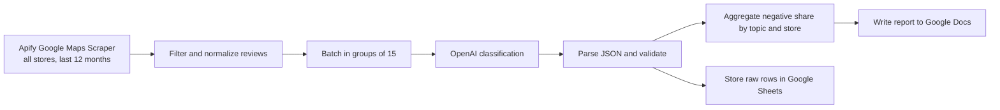

# Yabko Google Maps Review Intelligence

A review-analysis workflow that collects public customer feedback across a retail chain, classifies it by topic and sentiment, and turns the results into a practical report for the marketing team.

## Business problem

Yabko, a Ukrainian retail chain of Apple stores and service centers with 130+ locations, had thousands of public Google Maps reviews spread across many store cards. The team had no systematic way to see which topics and which locations generated the most negative feedback.

## Workflow

One n8n workflow handles the full cycle:

1. Apify Google Maps Scraper collects reviews from the last 12 months.
2. The workflow filters out competitor stores with similar names and removes reviews without text.
3. Reviews are batched in groups of 15 with short IDs such as r1 to r15.
4. An OpenAI model returns topic, sentiment, and a short summary as JSON.
5. A Code node parses the JSON with try/catch and marks failed batches as `parse_failed` instead of losing data.
6. Another Code node calculates negative share by topic and by store.
7. A second LLM writes a plain-language report in Google Docs.
8. Raw classified rows are saved in Google Sheets.

## Stack

`n8n` · `Apify` · `OpenAI` · `Google Sheets` · `Google Docs` · `JavaScript`

## Outcome

The project processed 5,794 reviews across 133 stores in 47 cities and classified 3,712 reviews with text. The output surfaced the most common negative topics and the stores that needed attention, with all figures computed in code before being passed to the reporting model.

## Privacy note

This project uses only public reviews and no personal data of reviewers.

## Modules

- `workflow.json`
