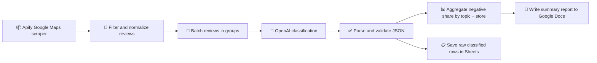

# 🧠 Yabko Google Maps Review Intelligence

### Turning public customer feedback into operational insight for a retail network

  <a href="../../">← Back to portfolio</a>
  ·
  <a href="https://github.com/RimmaMaevaL/portfolio/tree/main/projects/yabko-google-maps-review-intelligence">Browse project files</a>

---

## ✨ What this project does

This workflow collects public Google Maps reviews across many store cards, filters and normalizes the data, classifies each review by topic and sentiment, and turns the results into a practical business report.

It helps a retail chain identify which problems happen most often and where they are concentrated.

## 🎯 The business challenge

Yabko had thousands of public reviews spread across many store pages, but no systematic way to detect recurring issues or compare stores consistently. The challenge was not just collecting reviews — it was turning raw public feedback into usable operational insight.

## 🔄 Workflow at a glance

## 🧠 Why this matters

The system does more than count stars. It detects recurring negative themes, lets the marketing or operations team compare stores, and helps prioritize which branches need attention.

## 🛠️ Technology stack

| Component | Role |
|---|---|
| **n8n** | orchestration and data pipeline |
| **Apify** | public review scraping |
| **OpenAI** | topic and sentiment classification |
| **Google Sheets** | structured raw data storage |
| **Google Docs** | report generation |
| **JavaScript** | validation and aggregation logic |

## 📦 Included workflow modules

| File | Purpose |
|---|---|
| [`workflow.json`](workflow.json) | complete review intelligence workflow |

## ✅ Outcome

The project processed 5,794 reviews across 133 stores in 47 cities and classified 3,712 reviews with text. The output surfaced the most common negative topics and the stores that needed attention most quickly.

> The project uses only public reviews and does not expose personal reviewer data.

---

**Turn noisy reviews into clear business signals.**

