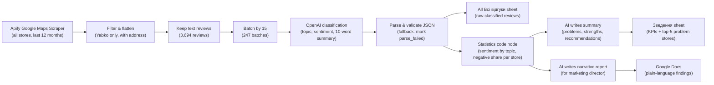

# Yabko Google Maps Review Intelligence

AI-powered analysis of customer reviews across a retail chain: identify pain points, detect strengths, and prioritize locations for follow-up.

**Format:** Free research project for Yabko (Ukrainian Apple electronics retail chain); report delivered to marketing director.  
**Links:** [Case study (UA)](https://app.notion.com/p/3ea4fc4d590f81579e58cfc3ffe401ba) · [Case study (EN)](https://app.notion.com/p/3ea4fc4d590f81f784e3f4f001d2513f)

## Business problem

The marketing team needed to understand what customers praise and criticize in public Google Maps reviews across all Yabko locations, without access to internal systems. Manual review was impractical; there was no visibility into store-by-store sentiment or recurring pain points.

## Solution overview

An n8n workflow automatically scrapes Google Maps reviews for all 132 Yabko locations, classifies each review by topic and sentiment using OpenAI, aggregates the findings into a summary sheet, and generates a narrative report for the marketing director.

## Architecture

## Key design decisions

- **Batch requests by 15 reviews instead of 1 per call:** 15× fewer AI calls (247 vs. 3,694). The LLM Chain's batching option limits parallelism to avoid rate limits.
- **No Structured Output Parser:** JSON is parsed in a Code node with try/catch, so no review is ever lost (0 parse_failed in production).
- **Short review ids (r1..r15) in prompts:** Google review ids are long and models can mangle them; mapping back happens in code.
- **Minimum 10 reviews per store before ranking:** One angry review out of two can't show up as 50% negative.
- **LLMs never calculate numbers:** All figures are computed in code and passed ready-made to models.
- **Two outputs for two audiences:** A one-screen summary sheet for managers and a narrative report for the marketing director; raw classified reviews stay in the data sheet for verification.

## Results

| Metric | Value |
|--------|-------|
| Locations analyzed | 132 (47 cities) |
| Reviews scraped | 5,744 (last 12 months) |
| Reviews with text (classified) | 3,694 (128 locations, 46 cities) |
| AI batches | 247 (0 parse_failed) |
| Scrape time | ~7 minutes |
| Positive sentiment | 94% (3,457 reviews) |
| Negative sentiment | 6% (209 reviews) |
| Locations with 10+ reviews (ranked) | 125 |

**Key insights:**

- **Strengths:** Staff and service quality dominate positive reviews (1,667 and 1,167 respectively). Customers consistently praise customer support and technical expertise.
- **Top pain points:** Trade-in valuations (42), warranty refusals and confusion (34), repair issues especially battery replacement (30), and stock discrepancies between online and in-store (12).
- **Templated replies finding:** 82 of 157 replies to negative reviews (52%) follow templates that don't address the specific complaint—a missed opportunity for engagement.
- **Problem stores as checklist, not verdict:** 125 locations qualify for ranking with 10+ reviews. The highest negative share is 29%; small sample sizes (15–36 per store) mean the ranking identifies *places to check*, not definitive verdicts.

## Lessons learned

- **Split Out behavior:** When using Split Out with "include other fields," the split value nests under the original key. First run produced empty reviews until the Set node read `$json.reviews.*`.
- **Pinned test data:** Test data on an AI node silently replaces real model calls. Always unpin before production runs.
- **Normalization matters:** The model once returned "трейд- ін" with a stray space, splitting one topic into two. Added normalization in the parse node.

## What I would improve next

- **Scheduled monthly runs:** Track sentiment and problem trends month-over-month.
- **Looker Studio dashboard:** Visualize sentiment by location, city, and date; filter by problem type.
- **Sentiment trend per store:** Alert when a store's negative ratio rises above its historical average.
- **Alert on new 1–2 star reviews:** Flag critical feedback in real-time for the operations team.
- **Reply quality check:** Score the chain's responses to negative reviews for specificity and empathy.

## Tech stack

- **Workflow orchestration:** n8n Cloud
- **Data collection:** Apify Google Maps Scraper
- **AI classification:** OpenAI (via n8n gateway credits)
- **Data storage & summary:** Google Sheets, Google Docs
- **Code & parsing:** JavaScript (n8n Code nodes)

## Screenshots

  
_The n8n workflow with 4 node groups: data collection, AI classification, summary sheet, and narrative report._

  
_The "Зведення" sheet with KPIs, top problems, strengths, and problem stores ranked by negative share._

  
_The "Всі відгуки" sheet with original review text and AI-determined topic, sentiment, and summary._

  
_The first page of the Google Docs report for the marketing director._

## Files

- `workflow.json` — Complete n8n workflow export (sanitized credentials and dataset ids)
- `images/` — Screenshot references (01-workflow.png, 02-summary-sheet.png, 03-reviews-sheet.png, 04-report.png)
