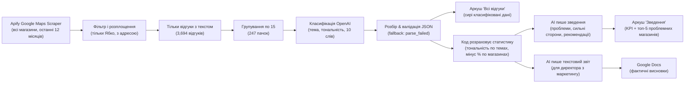

# Ябко: аналіз відгуків Google Maps

AI-аналіз відгуків клієнтів у мережі роздрібної торгівлі: виявлення болючих точок, розпізнавання сильних сторін та пріоритизація локацій для дій.

**Формат:** Безоплатне дослідження для Ябко (українська мережа магазинів техніки Apple); звіт передано директору з маркетингу.  
**Посилання:** [Кейс-стаді (UA)](https://app.notion.com/p/3ea4fc4d590f81579e58cfc3ffe401ba) · [Кейс-стаді (EN)](https://app.notion.com/p/3ea4fc4d590f81f784e3f4f001d2513f)

## Бізнес-проблема

Команда маркетингу мала розуміти, що клієнти хвалять і на що скаржаться в публічних відгуках Google Maps у всіх локаціях Ябко, але без доступу до внутрішніх систем. Ручний огляд був неможливий; не було видимості тональності по магазинах і повторюваних проблем.

## Огляд рішення

Workflow на n8n автоматично забирає відгуки Google Maps для всіх 132 локацій Ябко, класифікує кожен відгук за темою і тональністю за допомогою OpenAI, агрегує результати в зведення та генерує текстовий звіт для директора з маркетингу.

## Архітектура

## Ключові рішення дизайну

- **Пакування по 15 відгуків замість 1 на запит:** у 15 разів менше AI-запитів (247 замість 3,694). Batching у LLM Chain обмежує паралелізм від rate limits.
- **Без Structured Output Parser:** JSON розбирається в Code ноді з try/catch, тому жоден відгук не губиться (0 parse_failed у production).
- **Короткі id відгуків (r1..r15) у промптах:** довгі id Google модель може зіпсувати; mapping назад відбувається в коді.
- **Мінімум 10 відгуків на магазин до рейтингу:** один зліий відгук з двох не може дати 50% негативу.
- **LLM не рахують числа:** всі цифри рахуються в коді і передаються моделям готові.
- **Два виходи для двох аудиторій:** один екран зведення для менеджерів і текстовий звіт для директора; сирі класифіковані відгуки залишаються для перевірки.

## Результати

| Метрика | Значення |
|---------|----------|
| Проаналізовано локацій | 132 (47 міст) |
| Скреплено відгуків | 5,744 (останні 12 місяців) |
| Відгуків з текстом (класифіковано) | 3,694 (128 локацій, 46 міст) |
| AI-пачок обробено | 247 (0 parse_failed) |
| Час скрейпингу | ~7 хвилин |
| Позитивна тональність | 94% (3,457 відгуків) |
| Негативна тональність | 6% (209 відгуків) |
| Магазини з 10+ відгуками (ранжовані) | 125 |

**Ключові висновки:**

- **Сильні сторони:** персонал та якість сервісу домінують у позитивних відгуках (1,667 і 1,167 відповідно). Клієнти послідовно хвалять якість обслуговування та технічну експертизу.
- **Топ болючі точки:** низькі оцінки trade-in (42), відмови у гарантії та плутанина (34), проблеми після ремонту особливо батареї (30), різниця в наявності товару між сайтом і магазином (12).
- **Знахідка про шаблонні відповіді:** 82 з 157 відповідей на негативні відгуки (52%) слідують шаблонам, які не адресують конкретну скаргу — пропущена можливість залучення.
- **Проблемні магазини як чек-лист, не вердикт:** 125 локацій кваліфікуються для ранжування з 10+ відгуками. Найвища частка негативу 29%; малі розміри вибірок (15–36 на магазин) озн��чають, що рейтинг ідентифікує *місця для перевірки*, а не остаточні вердикти.

## Уроки, вивчені

- **Поведінка Split Out:** Split Out з "include other fields" вкладає розділене значення під вихідний ключ. Перший запуск видав пусті відгуки поки Set ніда не прочитала `$json.reviews.*`.
- **Pinned test data:** test data на AI ноді мовчки замінює реальні запити. Завжди unpin перед production.
- **Нормалізація важлива:** модель один раз повернула "трейд- ін" зі стороннім пробілом, розщеплюючи одну тему на дві. Додано нормалізацію у parse ноді.

## Що я б поліпшив наступного разу

- **Запланувані щомісячні запуски:** відстежування трендів тональності та проблем з місяця на місяць.
- **Looker Studio дашборд:** візуалізація тональності по локаціях, містах та датам; фільтрація за типом проблеми.
- **Тренд тональності по магазинах:** алерт коли негативна частка магазину піднімається вище історичного середнього.
- **Алерт на нові 1–2 зіркові відгуки:** флагування критичного фідбеку в реальному часі для операційної команди.
- **Перевірка якості відповідей:** оцінка відповідей мережі на негативні відгуки за специфічністю та емпатією.

## Технічний стек

- **Оркестрація workflow:** n8n Cloud
- **Збір даних:** Apify Google Maps Scraper
- **AI-класифікація:** OpenAI (через n8n gateway credits)
- **Сховище даних & зведення:** Google Sheets, Google Docs
- **Код & розбір:** JavaScript (n8n Code nodes)

## Скріншоти

  
_Workflow n8n з 4 групами нод: збір даних, AI-класифікація, аркуш зведення, текстовий звіт._

  
_Аркуш "Зведення" з KPI, топ-проблемами, сильними сторонами та проблемними магазинами за часткою негативу._

  
_Аркуш "Всі відгуки" з вихідним текстом відгуку та AI-визначеною темою, тональністю і резюме._

  
_Перша сторінка Google Docs звіту для директора з маркетингу._

## Файли

- `workflow.json` — Повний експорт n8n workflow (залишені облікові дані і dataset id замінені на плейсхолдери)
- `images/` — Посилання на скріншоти (01-workflow.png, 02-summary-sheet.png, 03-reviews-sheet.png, 04-report.png)
